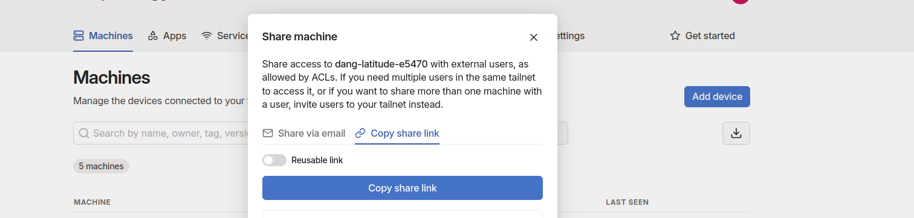
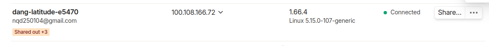

# Kmean-mapreduce-pyspark-multicluster-tutorial
How to Set Up a Network to Connect Spark Master and Spark Workers to Run Parallel Algorithms for Big Data (KMeans-MapReduce PySpark)
This repository contains a step-by-step guide and implementation for setting up a distributed Spark cluster to run KMeans clustering with PySpark. It includes configuration instructions for connecting Spark Master and Spark Workers across different machines, as well as a sample PySpark script for running the KMeans algorithm on large datasets.

## Prerequisites

- Java Development Kit (JDK)
- Apache Spark
- Python and PySpark
- Tailscale for network connection

## Setting Up Tailscale

First, we will use Tailscale to create a common network connecting all devices.

1. Go to [Tailscale Login](https://login.tailscale.com/) to create an account and log in.
2. On your device's terminal/cmd, run the following command to connect your device to your Tailscale network:
   ```sh
   tailscale up
   # or for sudo users
   sudo tailscale up
   ```
3. You will be redirected to confirm the connection. Once confirmed, your device will be connected.
4. In the Tailscale UI, you will see a "Share" button next to the three-dot menu. Click it, then click "Copy share link" and send this link to other devices.


5. Other devices will use this link and click "Accept" to join the network.

## Installing Spark
1. Download Spark from Apache Spark Downloads.
2. Extract the file and set the Spark folder location:
   ```sh
   export SPARK_HOME=<path_to_spark_folder>
   ```
3. Similarly, set the Java folder location:
   ```sh
   export JAVA_HOME=<path_to_java_folder>
   ```
4. Add these configurations to your PATH:
   ```sh
    export PATH=$PATH:$JAVA_HOME/bin
    export PATH=$PATH:$SPARK_HOME/bin
   ```
5. Now, you can start Spark on your machine using the command:
   ```sh
    $SPARK_HOME/sbin/start-master.sh
   ```
6. You can check the Spark UI at localhost:8080.

## Configuring Spark for Multiple Devices
1. To configure Spark for multiple devices, go to the conf directory in $SPARK_HOME (the Spark installation directory). You will find the following template files: workers.template, spark-env.sh.template, and spark-defaults.conf.template. Create copies of these files using the following commands:
   ```sh
    cp workers.template workers
    cp spark-defaults.conf.template spark-defaults.conf
    cp spark-env.sh.template spark-env.sh
   ```
2. Check your Tailscale IP address at [Tailscale Admin](https://login.tailscale.com/admin/machines) and add the following lines to the end of the newly created spark-env.sh file:
   ```sh
    export SPARK_MASTER_HOST=<your_tailscale_ip>
    export SPARK_LOCAL_IP=<your_tailscale_ip>
   ```
   To edit the spark-env.sh file from the command line, you can use the following command:
   ```sh
    nano $SPARK_HOME/conf/spark-env.sh
   ```
   Now, you can check the Spark UI at `<master_tailscale_ip>:8080` and ensure that all devices connected to Tailscale can access it.
   [Master-UI](images/master.jpg)
3. Set up the workers similarly and run the following command to connect the worker to the master:
   ```sh
    $SPARK_HOME/sbin/start-worker.sh spark://<master-tailscale-ip>:7077
   ```
    [Add-worker](images/sub_worker.jpg)
4. On the Spark UI, you will notice the recently added worker in the workers section, indicating a successful connection.
    [Add-done](images/worker_up.jpg)
By following these steps, you will have a fully configured Spark cluster running across multiple devices, ready to process large datasets with parallel algorithms like KMeans in PySpark. 