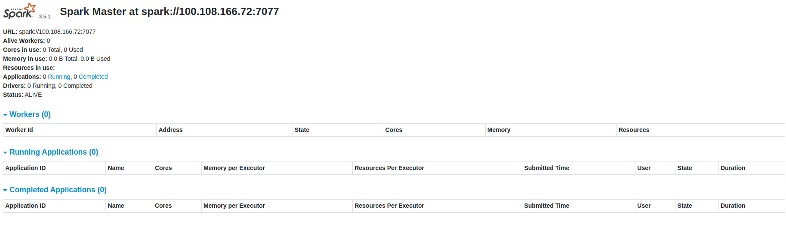
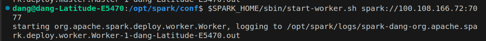
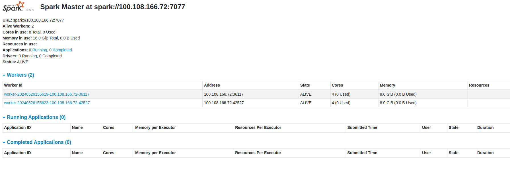

# Kmean-mapreduce-pyspark-multicluster-tutorial
How to Set Up a Network to Connect Spark Master and Spark Workers to Run Parallel Algorithms for Big Data (KMeans-MapReduce PySpark)
This repository contains a step-by-step guide and implementation for setting up a distributed Spark cluster to run KMeans clustering with PySpark. It includes configuration instructions for connecting Spark Master and Spark Workers across different machines, as well as a sample PySpark script for running the KMeans algorithm on large datasets.

## Prerequisites

- Java Development Kit (JDK)
- Apache Spark
- Python and PySpark
- Tailscale for network connection

## Setting Up Tailscale

First, we will use Tailscale to create a common network connecting all devices.

1. Go to [Tailscale Login](https://login.tailscale.com/) to create an account and log in.
2. On your device's terminal/cmd, run the following command to connect your device to your Tailscale network:
   ```sh
   tailscale up
   # or for sudo users
   sudo tailscale up
   ```
3. You will be redirected to confirm the connection. Once confirmed, your device will be connected.
4. In the Tailscale UI, you will see a "Share" button next to the three-dot menu. Click it, then click "Copy share link" and send this link to other devices.


5. Other devices will use this link and click "Accept" to join the network.

## Installing Spark
1. Download Spark from Apache Spark Downloads. (you can refer to this [Blog](https://login.tailscale.com/))
2. Extract the file and set the Spark folder location:
   ```sh
   export SPARK_HOME=<path_to_spark_folder>
   ```
3. Similarly, set the Java folder location:
   ```sh
   export JAVA_HOME=<path_to_java_folder>
   ```
4. Add these configurations to your PATH:
   ```sh
    export PATH=$PATH:$JAVA_HOME/bin
    export PATH=$PATH:$SPARK_HOME/bin
   ```
5. Now, you can start Spark on your machine using the command:
   ```sh
    $SPARK_HOME/sbin/start-master.sh
   ```
6. You can check the Spark UI at localhost:8080.

## Configuring Spark for Multiple Devices
1. To configure Spark for multiple devices, go to the conf directory in $SPARK_HOME (the Spark installation directory). You will find the following template files: workers.template, spark-env.sh.template, and spark-defaults.conf.template. Create copies of these files using the following commands:
   ```sh
    cp workers.template workers
    cp spark-defaults.conf.template spark-defaults.conf
    cp spark-env.sh.template spark-env.sh
   ```
2. Check your Tailscale IP address at [Tailscale Admin](https://login.tailscale.com/admin/machines) and add the following lines to the end of the newly created spark-env.sh file:
   ```sh
    export SPARK_MASTER_HOST=<your_tailscale_ip>
    export SPARK_LOCAL_IP=<your_tailscale_ip>
   ```
   To edit the spark-env.sh file from the command line, you can use the following command:
   ```sh
    nano $SPARK_HOME/conf/spark-env.sh
   ```
   To grant sufficient permissions for the worker to connect to the master, you need to add the following configurations to the end of the `spark-defaults.conf` file in the `spark/conf` folder:
   ```sh
   spark.authenticate true
   spark.authenticate.secret <you-secret-key>
   spark.acls.enable true
   spark.ui.view.acls=*
   spark.modify.acls=*
   spark.ui.view.acls.groups=*
   spark.modify.acls.groups=*
   ```
   You can generate a random secret key for `<you-secret-key>` using a variety of tools and programming languages. Here is a simple example using Python, which is commonly available on most systems. This command will generate a random secret key and print it to the console:
   ```sh
    openssl rand -base64 32
   ```
   Now, you can check the Spark UI at `<master_tailscale_ip>:8080` and ensure that all devices connected to Tailscale can access it.
   
4. Set up the workers similarly and run the following command to connect the worker to the master:
   ```sh
    $SPARK_HOME/sbin/start-worker.sh spark://<master-tailscale-ip>:7077
   ```
    
5. On the Spark UI, you will notice the recently added worker in the workers section, indicating a successful connection.
    
By following these steps, you will have a fully configured Spark cluster running across multiple devices, ready to process large datasets with parallel algorithms like KMeans in PySpark.

## Kmean pyspark mapreduce explaination
- First thing in all pyspark code is you need to start a spark session and connect it to some master. In my case, I use SparkContext (don't worry, pyspark session always provide a way to connect to master's server)
   ```sh
   conf = SparkConf().setAppName("Kmean_RandomImage").setMaster("local[*]") #set to your master-tailscale-ip (ex: spark://100.108.166.72:7077)
   sc = SparkContext(conf=conf)
   ```
- In the end you will need to stop the spark session or you will run in some error like this machine cant handle 2 spark session
   ```sh
   sc.stop()
   ```
- Alright so let dive in the kmean-mapreduce, in the MAP part, it will try to map your data into (key, value) pair. For ex, in my code :
   ```sh
   closest = data_rdd.map(lambda x: (np.argmin([np.linalg.norm(x - c) for c in centroids.value]), (x, 1)))
   ```
   I mapped all 1x3 vector into (nearest cluster, (that vector, 1)) pair, key = nearest cluster, value = (that vector, 1)
  
- In the REDUCE part, we will group all (key, value) pair which has the same key (achieved in previous stage) together then reduce it into a single value
   ```sh
   sums = closest.reduceByKey(lambda x, y: (np.add(x[0], y[0]).astype(np.float64), x[1] + y[1]))
   ```
   all (nearest cluster, (that vector, 1)) turn into (sum of all vector, count), pay attention that this is another (key, value) pair, this is a trick for implementation
- Finally, we just need to recompute the cluster position to achive complete Kmean algorithm
   ```sh
   new_centroids = sums.map(lambda x: (x[0], [x[1][0][i] / x[1][1] for i in range(len(x[1][0]))])).collect()
   ```

That's the end of our tutorial, this thing gave us a really hard time so we just think sb else will need it as much as us. Feel free to report bugs/errors or ask any questions.
